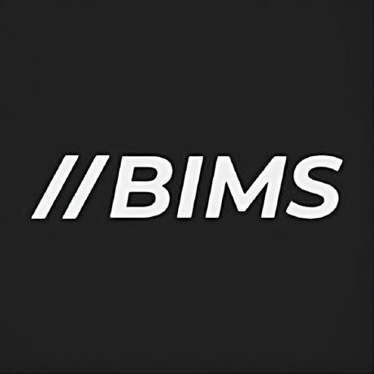

# Express.js Starter Kit

Proyek ini adalah *Express.js Starter Kit*, sebuah template dasar yang dirancang untuk memulai pengembangan aplikasi web atau API menggunakan Express.js, framework minimalis dan fleksibel untuk Node.js. Starter kit ini mencakup berbagai fitur dasar dan struktur yang dapat diadaptasi untuk berbagai jenis aplikasi, baik aplikasi web sederhana, API RESTful, maupun aplikasi web yang lebih kompleks dengan rendering server-side.

## Tujuan Proyek

Tujuan dari proyek ini adalah memberikan kerangka kerja yang solid dan mudah dipahami bagi pengembang yang ingin memulai proyek menggunakan Express.js. Dengan menggunakan starter kit ini, Anda bisa fokus pada logika bisnis dan fitur aplikasi tanpa perlu menghabiskan waktu untuk pengaturan awal yang berulang.

## Fitur Utama

- *Express.js*: Framework minimalis yang menjadi tulang punggung aplikasi web Node.js.
- *Routing Modular*: Struktur rute yang modular untuk menjaga kode tetap rapi dan terorganisir.
- *Middleware Kustom*: Contoh penggunaan middleware kustom untuk menangani autentikasi, logging, dan validasi.
- *Templating Engine*: Integrasi dengan EJS (Embedded JavaScript) untuk merender halaman dinamis dari server.
- *Pengelolaan File Statis*: Konfigurasi untuk melayani file statis seperti CSS, JavaScript, dan gambar.
- *Konfigurasi Lingkungan*: Menggunakan dotenv untuk mengelola konfigurasi lingkungan secara aman.
- *Pengaturan Error Handling*: Penanganan kesalahan global dan middleware untuk menangani error secara elegan.
- *Struktur Folder yang Terorganisir*: Struktur proyek yang memungkinkan pengembangan yang mudah dan terukur.
- *Pre-built API Routes*: Contoh rute API yang siap digunakan sebagai dasar pengembangan API RESTful.
- *Dukungan Pengujian*: Integrasi dengan framework pengujian seperti Mocha atau Jest untuk memastikan kualitas kode.
- *Deployable*: Siap untuk di-deploy di berbagai platform seperti Heroku, Vercel, atau layanan cloud lainnya.

## Persyaratan Sistem

Pastikan Anda memiliki perangkat lunak berikut sebelum memulai:

- *Node.js* (versi 14 atau lebih baru)
- *npm* (Node Package Manager) atau *yarn*
- *Git* untuk meng-clone repository

## Instalasi dan Setup

### 1. Clone Repository

Mulailah dengan meng-clone repository ini ke dalam direktori lokal Anda:

```
git clone https://github.com/Biimmss/belajar_rsapi.git
```

